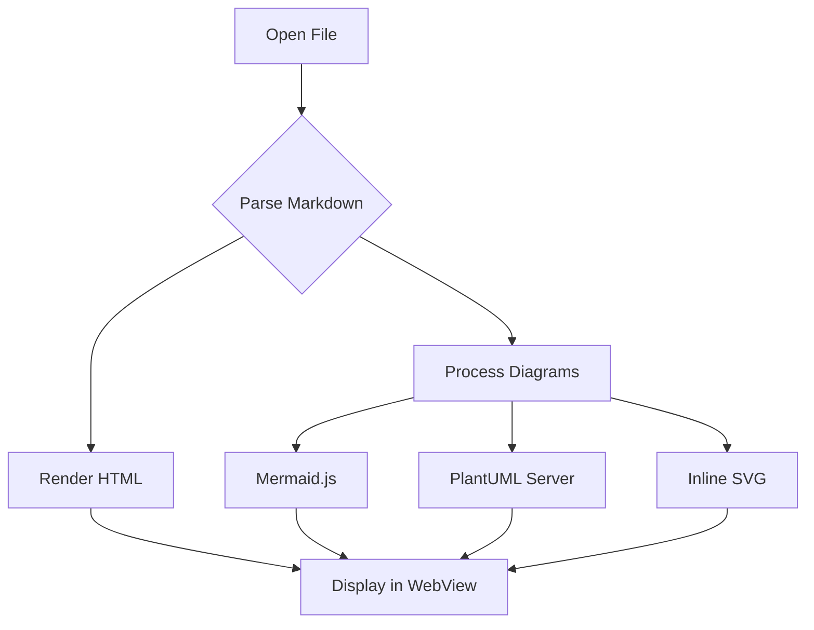
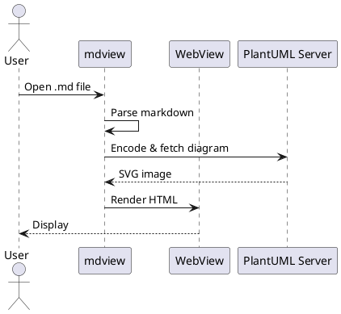

# mdview Demo

Welcome to **mdview**, a markdown viewer with diagram support.

## Features

- Markdown rendering with full GFM support
- PlantUML diagrams
- Mermaid diagrams
- SVG rendering
- Inter-document links
- Live reload on file changes
- Configurable themes and fonts

## Code Block

```rust
fn main() {
    println!("Hello, mdview!");
}
```

## Mermaid Diagram



## PlantUML Diagram



## SVG Diagram


## Inline SVG

```svg
<svg xmlns="http://www.w3.org/2000/svg" viewBox="0 0 300 80" width="300" height="80">
  <rect x="5" y="5" width="80" height="35" rx="6" fill="none" stroke-width="2"/>
  <text x="45" y="28" text-anchor="middle" font-family="sans-serif" font-size="12">Input</text>
  <line x1="85" y1="22" x2="115" y2="22" stroke-width="2"/>
  <polygon points="115,17 125,22 115,27" fill="currentColor"/>
  <rect x="125" y="5" width="80" height="35" rx="6" fill="none" stroke-width="2"/>
  <text x="165" y="28" text-anchor="middle" font-family="sans-serif" font-size="12">Process</text>
  <line x1="205" y1="22" x2="235" y2="22" stroke-width="2"/>
  <polygon points="235,17 245,22 235,27" fill="currentColor"/>
  <rect x="245" y="5" width="50" height="35" rx="6" fill="none" stroke-width="2"/>
  <text x="270" y="28" text-anchor="middle" font-family="sans-serif" font-size="12">Out</text>
</svg>
```

## Table

| Feature       | Status |
|--------------|--------|
| Markdown     | Done   |
| Mermaid      | Done   |
| PlantUML     | Done   |
| SVG          | Done   |
| Links        | Done   |
| File Watch   | Done   |
| Themes       | Done   |

## Task List

- [x] Basic markdown rendering
- [x] Mermaid support
- [x] PlantUML support
- [x] SVG support
- [x] Document links
- [x] Live reload
- [x] Theme configuration

## Blockquote

> mdview renders markdown beautifully in a native window,
> with support for diagrams and live reload.

## Link to Another Document

[See the linked document](linked.md)

---

*Built with Rust, wry, and pulldown-cmark.*
